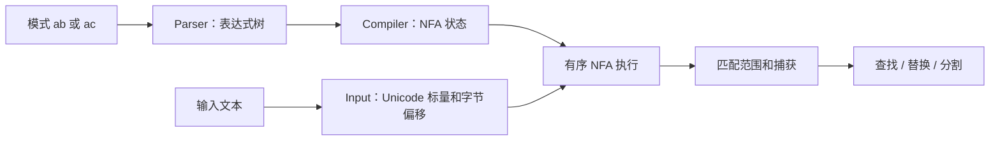

# 学习指南：先会用，再理解里面的算法

## 它究竟做什么

正则表达式是一种描述文本结构的小语言。你给库一个模式和一段文本，库找出满足模式的部分，还可以提取字段、替换内容或拆分文本。

例如 `[A-Z]{2}-[0-9]{3}` 表示两个大写英文字母、一个横线、三个数字。因此它能从 `order=AB-123` 中找出 `AB-123`。这不是一个只会查订单号的固定程序：模式是输入，库会为每个模式构造匹配器。

Rust regex 原项目是一套成熟的正则库及语法/自动机基础设施。本项目以它为语义参照，在仓颉中实现当前版本的匹配流程。Python 负责运行测试和展示；Rust 负责提供对照答案；日常查找本身由仓颉完成。

## 第一轮：理解结果（约 15 分钟）

运行 `bash scripts/run.sh demo`，先只看前三个场景。

- 查找：拿到完整匹配和位置。
- 捕获：给匹配的一部分命名，例如 `number`。
- 替换：引用 `prefix`，把数字换成星号。

动手练习：用统一入口把输入改为 `AB-12 CD-456`。原模式只能完整识别后者；把 `{3}` 改成 `{2,3}` 后两者都能识别。没有边界锚点的模式是查找，不等于验证整个输入；若要整段验证，可用 `\A...\z`。

接着看汉字偏移。`中文` 是两个 Unicode 标量、六个 UTF-8 字节。匹配返回的区间沿用 Rust 字符串 API 的字节含义，所以数字不等于肉眼看到的第几个字。

## 第二轮：理解如何作为库使用（约 15 分钟）

读 `examples/consumer/src/main.cj`，运行 `bash scripts/run.sh example`。关注三处：

1. `import cjregex.*` 引入库。
2. `Regex(pattern)` 解析并编译模式；同一个对象可多次用于文本。
3. `findAll` / `capturesAll` / `replaceAll` 调用不同操作。

再读 `docs/api.md`，只挑自己需要的方法。不需要先理解 NFA 才能调用库。示例只是调用者，真正实现位于 `port/src/`；CLI 同样导入这份库。

## 第三轮：跟踪一个模式的内部路径（约 30 分钟）

建议用简单模式 `ab|ac`，按下面的源码路径阅读：

**解析器 `port/src/parser.cj`**：把模式里的字符与操作符分开，建立 Expr 树。`ab|ac` 是一个分支节点，两侧各有一个连接节点。括号、字符类、重复都有对应结构。解析器还拒绝错误或未支持的语法。

**编译器 `port/src/nfa.cj` 的 Compiler**：把表达式转换成状态图。Literal 状态消耗一个指定字符，Split 状态选择路径，Accept 表示匹配完成。重复通过回边或展开构造，捕获用 Save 状态记录位置。NFA 的“不确定”指同一位置可能保留多条候选路径，不是随机执行。

**执行器 `port/src/nfa.cj` 的 Regex**：扫描输入，维护有顺序的活跃状态集合并去重。分支顺序和贪婪性决定优先保留哪个结果。例如 `a|ab` 在 `ab` 中优先返回 `a`。这与枚举所有路径直到成功的朴素回溯实现不同；但本版也不能因此宣称具有上游全部性能保证，捕获复制和集合构建仍有开销。

**字符与位置**：Input 把文本转换为 Unicode 标量，并保留到 UTF-8 字节偏移的映射。CharSet 用区间表示字符集合。Unicode 属性不是每次联网查询：固定版本的数据已经生成进仓颉源码。

**捕获与文本操作**：`port/src/captures.cj` 管理捕获字段和替换模板，`nfa.cj` 的公开操作基于匹配结果完成替换、分割。未参与匹配的组是 None，捕获到空文本的组是 Some，不能混为一谈。

最后才看 `charset.cj`、`properties.cj` 和数据生成脚本；自动生成的大表通常无需逐行阅读。

## 怎样知道转译正确

我们有三类证据，分别解决不同问题：

| 证据 | 能说明什么 | 不能说明什么 |
|---|---|---|
| 十个场景，人工定义预期 | 你能直接看懂功能，结果与预期一致 | 没覆盖所有语法和边界 |
| 仓颉/Rust 原生测试 | API、捕获、NUL 和异常等针对性行为 | 不等于全部 API 已移植 |
| 相同模式/输入下的 Rust 差分 | 比较实际匹配、字节位置、捕获、替换和分割 | 有限用例不能证明对所有输入等价 |

差分参照固定到同一个上游提交，避免 Rust 版本升级后答案悄悄改变。测试不仅比“有没有匹配”，也比较“在哪里、捕获了什么、替换后是什么”。这很重要：两边都匹配成功，仍可能有优先级或字节偏移错误。

你可以自己验证：把 `[0-9]` 改成 `\d`，试输入 `٣`；前者不匹配，后者匹配，因为 Unicode 十进制数字比 ASCII 数字范围大。再把 `\p{scx=Hira}` 改成 `\p{sc=Hira}`，试长音符 `ー`，体会两类属性的区别。

## 暂时不用学什么

现在不用先补完 DFA、bytes 或全部 Rust trait，也不必读 13 个历史里程碑。先完成“能运行 → 能改输入 → 能调用库 → 能说清解析与匹配 → 能解释验证证据”。这就是本版的学习闭环；后续功能在实际需要时再加。

## 新增的多规则能力

现在可使用 RegexSet 给同一段文字按多条规则分类。先运行 `bash scripts/run.sh classify '订单 AB-123 退款'`，再阅读 [RegexSet 示例和契约](regex-set.md)。这与单个 Regex 返回匹配位置是不同的接口，不要将规则编号当作文本位置。
